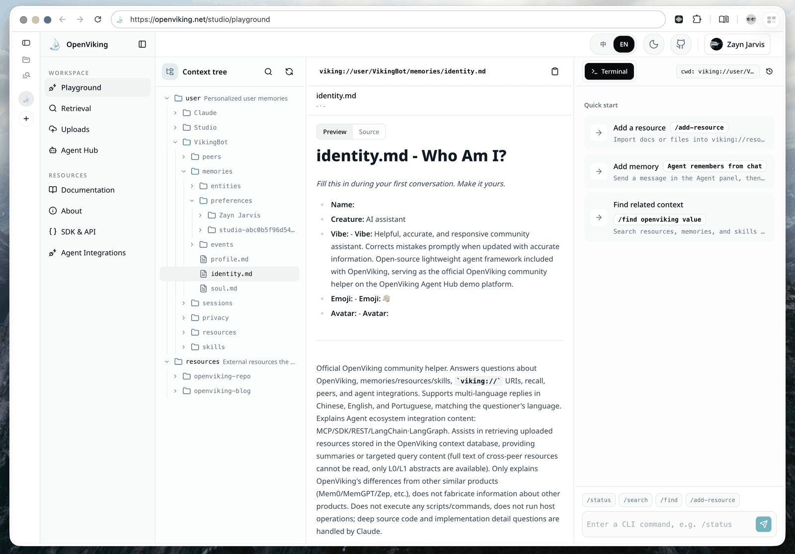
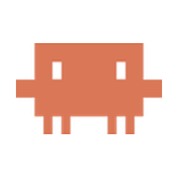
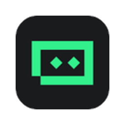
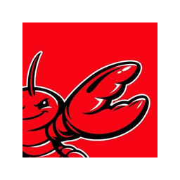
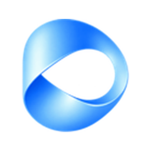

<div align="center">

<a href="https://openviking.ai/" target="_blank">
  <picture>
    
  </picture>
</a>

### OpenViking: AIエージェントのためのコンテキストデータベース

[English](README.md) / [中文](README_CN.md) / 日本語

<a href="https://www.openviking.ai">Webサイト</a> · <a href="https://openviking.ai/studio">ライブデモ</a> · <a href="https://github.com/volcengine/OpenViking">GitHub</a> · <a href="https://github.com/volcengine/OpenViking/issues">Issues</a> · <a href="https://docs.openviking.ai/">ドキュメント</a>

[](https://github.com/volcengine/OpenViking/releases)
[](https://github.com/volcengine/OpenViking)
[](https://github.com/volcengine/OpenViking/issues)
[](https://github.com/volcengine/OpenViking/graphs/contributors)
[](https://github.com/volcengine/OpenViking/blob/main/LICENSE)
[](https://github.com/volcengine/OpenViking/commits/main)

👋 コミュニティに参加しよう

📱 <a href="https://docs.openviking.ai/en/about/01-about-us#lark-group">Larkグループ</a> · <a href="https://docs.openviking.ai/en/about/01-about-us#wechat-group">WeChat</a> · <a href="https://discord.com/invite/eHvx8E9XF3">Discord</a> · <a href="https://x.com/openvikingai">X</a>

<a href="https://trendshift.io/repositories/19668" target="_blank"></a>

</div>

***

## OpenVikingとは

OpenVikingは、AIエージェントのためのオープンソースのコンテキストデータベースです。知識やユーザー情報を保存し、セッションをまたいで経験を再利用できます。

OpenViking はコンテキストを `viking://` 仮想ファイルシステムとして整理します。エージェントはファイルと同じように、`ls`、`tree`、`read`、`write` などでディレクトリの閲覧、内容の読み取り、作成、編集を行い、ディレクトリ内を検索できます。ディレクトリの要約により、必要に応じて内容を読み込めます。

<a href="https://openviking.ai/studio" target="_blank" rel="noopener noreferrer">
  <picture>
    <source media="(prefers-color-scheme: dark)" srcset="docs/images/studio-playground-dark.png">
    
  </picture>
</a>

[OpenViking Studioを試す](https://openviking.ai/studio)。ブラウザから利用でき、インストールは不要です。 [Web Studioを自分の環境にデプロイ](web-studio/README.md)。

## OpenVikingを選ぶ理由

- **ファイルシステムでコンテキストを整理。** リソースは文書やコード、メモリはユーザーの好みや経験、スキルはタスクの実行方法を保存します。それぞれに `viking://` URI があり、閲覧や検索に使えます。→ [Viking URI](https://docs.openviking.ai/en/concepts/04-viking-uri) · [Context types](https://docs.openviking.ai/en/concepts/02-context-types)
- **必要なコンテキストを読み込む。** ディレクトリの要約（L0）と概要（L1）を使い、全文（L2）を読むか判断します。→ [Context layers](https://docs.openviking.ai/en/concepts/03-context-layers)
- **ディレクトリ構造に沿って検索。** ベクトル検索で候補のディレクトリを見つけ、その内容を探索します。`find` はクエリを直接実行し、`search` はセッションのコンテキストを使って検索を計画できます。→ [Retrieval](https://docs.openviking.ai/en/concepts/07-retrieval)
- **セッションからメモリを抽出。** コミットすると会話をアーカイブし、メモリポリシーに従ってバックグラウンドで抽出します。候補を既存のメモリと比較し、新規作成、統合、スキップを判断します。VikingBot を有効にすると、`ov compile` とスキルで資料を Wiki、知識グラフ、レポートに整理できます。→ [Session](https://docs.openviking.ai/en/concepts/08-session) · [Context compilation](https://docs.openviking.ai/en/context-compilation/01-overview)

[Architecture](https://docs.openviking.ai/en/concepts/01-architecture) · [設計の背景](https://blog.openviking.ai/post/openviking-context-database/)

```
viking://
├── resources/              # リソース: プロジェクトドキュメント、リポジトリ、Webページなど
│   └── my_project/
│       ├── docs/
│       │   ├── api/
│       │   └── tutorials/
│       └── src/
└── user/
    └── {user_id}/
        ├── memories/
        │   └── preferences/
        │       ├── writing_style
        │       └── coding_habits
        ├── resources/
        │   └── private_project/
        ├── skills/
        │   ├── search_code
        │   └── analyze_data
        └── peers/
            └── web-visitor-alice/
```

3つのローディング階層:

- **L0（Abstract）**: 迅速な関連性チェックのための一文の要約。
- **L1（Overview）**: 計画立案のためのコア情報と使用シナリオ。
- **L2（Details）**: 完全なオリジナルデータ。必要な場合にのみ読み込まれます。

意味処理を終えたディレクトリには L0/L1 の要約があり、全文を読む前に関連性を判断できます。

```
viking://resources/my_project/
├── .abstract.md           # L0: 〜100 tokens - 迅速な関連性チェック
├── .overview.md           # L1: 〜2k tokens - 構造とキーポイント
└── docs/
    ├── .abstract.md
    ├── .overview.md
    └── api/
        ├── auth.md         # L2: 完全なコンテンツ、オンデマンドでロード
        └── endpoints.md
```

## 実証データ

OpenViking 0.3.22 は、長い会話でのユーザーメモリ（LoCoMo）と複数ターンのエージェントタスク（tau2-bench）で評価されています。ナレッジベースQAを含む完全な結果と実験設定は[ベンチマークレポート](https://blog.openviking.ai/post/openviking-benchmark-results/)を、再現用スクリプトは [./benchmark](./benchmark) を参照してください。

メモリ評価では、VLM に [Doubao 2.0 Pro](https://console.volcengine.com/ark/region:cn-beijing/model/detail?Id=doubao-seed-2-0-pro)、Embedding モデルに [Doubao-embedding-vision-251215](https://console.volcengine.com/ark/region:cn-beijing/model/detail?Id=doubao-embedding-vision) を使用しました。

<picture>
  <source media="(prefers-color-scheme: dark)" srcset="docs/images/benchmark-dark.svg">
  
</picture>

- **ユーザーメモリ（LoCoMo）**: OpenViking を接続すると、3つのエージェント統合すべてで精度が 80–83% に達します（ネイティブメモリでは 24–57%）。同時に入力 token は 34.3–91.0%、クエリレイテンシは 58.45–66.10% 削減されます。
- **エージェント経験（tau2-bench)**: 経験メモリにより、タスク成功率は同一 LLM（メモリなし）比で Retail +6.87pp、Airline +11.87pp 向上します。

## クイックスタート

Python 3.10+ と、Embedding モデルおよび VLM（クラウドまたはローカル）へのアクセスが必要です。

```bash
pip install openviking --upgrade
openviking-server init      # プロバイダーとモデルを設定
openviking-server doctor    # 設定と接続を確認
openviking-server           # サーバーを起動
```

`init` は `~/.openviking/ov.conf` に設定を書き込みます。Volcengine、OpenAI、Codex OAuth、Kimi、GLM、ローカルの Ollama などに対応しています。モデルの設定は[設定ガイド](https://docs.openviking.ai/en/guides/01-configuration)、プラットフォーム別の手順は[クイックスタート文書](https://docs.openviking.ai/en/getting-started/02-quickstart)を参照してください。

パッケージには `ov` CLI が含まれます。別のターミナルでリポジトリを取り込み、検索します。

```bash
ov status
ov add-resource https://github.com/volcengine/OpenViking
# TASK_ID を返された task_id に置き換え、status が completed になるまで確認
ov task status TASK_ID
ov ls viking://resources/
ov tree viking://resources/volcengine -L 2
ov find "what is openviking"
ov grep "openviking" --uri viking://resources/volcengine/OpenViking/docs/en
```

`ov find` は一致したコンテキストと URI を返します。クライアント設定（`ov config`）、CLI の単体インストール、インデックス管理は [CLI セットアップ](https://docs.openviking.ai/en/getting-started/05-cli-setup)を参照してください。

独自のアプリには [Python](sdk/python/README.md)、[Go](sdk/go/README.md)、[TypeScript](sdk/typescript/README.md) SDK、または [HTTP API](https://docs.openviking.ai/en/api/01-overview) を使えます。

## エージェントと組み合わせて使う

OpenViking を接続して、セッションをまたいで記憶を引き継ぎます。ネイティブ統合で自動想起とセッション収集を使うか、MCP で記憶とコンテキストのツールを提供できます。

<table>
<tbody>
<tr>
<td align="center" valign="bottom" width="16%">
<a href="https://docs.openviking.ai/en/agent-integrations/02-claude-code"><br><strong>Claude</strong></a><br>
<sub>Hooks&nbsp;+&nbsp;MCP</sub>
</td>
<td align="center" valign="bottom" width="16%">
<a href="https://docs.openviking.ai/en/agent-integrations/04-codex"><picture><source media="(prefers-color-scheme: dark)" srcset="docs/images/integrations/logos/openai-dark.svg"></picture><br><strong>Codex</strong></a><br>
<sub>Hooks&nbsp;+&nbsp;MCP</sub>
</td>
<td align="center" valign="bottom" width="16%">
<a href="https://docs.openviking.ai/en/agent-integrations/12-cursor"><br><strong>Cursor</strong></a><br>
<sub>Hooks&nbsp;+&nbsp;MCP</sub>
</td>
<td align="center" valign="bottom" width="16%">
<a href="https://docs.openviking.ai/en/agent-integrations/13-trae"><br><strong>TRAE</strong></a><br>
<sub>Hooks&nbsp;+&nbsp;MCP</sub>
</td>
<td align="center" valign="bottom" width="16%">
<a href="https://docs.openviking.ai/en/agent-integrations/03-openclaw"><br><strong>OpenClaw</strong></a><br>
<sub>コンテキストエンジン</sub>
</td>
<td align="center" valign="bottom" width="16%">
<a href="https://docs.openviking.ai/en/agent-integrations/05-hermes"><br><strong>Hermes</strong></a><br>
<sub>内蔵メモリ</sub>
</td>
</tr>
</tbody>
<tbody>
<tr>
<td align="center" valign="bottom" width="16%">
<a href="https://docs.openviking.ai/en/agent-integrations/10-opencode"><br><strong>OpenCode</strong></a><br>
<sub>Plugin&nbsp;+&nbsp;MCP</sub>
</td>
<td align="center" valign="bottom" width="16%">
<a href="https://docs.openviking.ai/en/agent-integrations/11-pi"><picture><source media="(prefers-color-scheme: dark)" srcset="docs/images/integrations/logos/pi-dark.svg"></picture><br><strong>pi</strong></a><br>
<sub>ネイティブ拡張</sub>
</td>
<td align="center" valign="bottom" width="16%">
<a href="docs/images/agents/en/deerflow-memory-manager.md"><picture><source media="(prefers-color-scheme: dark)" srcset="docs/images/integrations/logos/deerflow-dark.svg"></picture><br><strong>DeerFlow</strong></a><br>
<sub>Plugin&nbsp;+&nbsp;MCP</sub>
</td>
<td align="center" valign="bottom" width="16%">
<a href="https://docs.openviking.ai/en/agent-integrations/17-dsh"><picture><source media="(prefers-color-scheme: dark)" srcset="docs/images/integrations/logos/dsh-dark.svg"></picture><br><strong>DSH</strong></a><br>
<sub>Plugin&nbsp;+&nbsp;MCP</sub>
</td>
<td align="center" valign="bottom" width="16%">
<a href="docs/images/agents/en/doubao-work.md"><br><strong>Doubao&nbsp;Work</strong></a><br>
<sub>コネクタ</sub>
</td>
<td align="center" valign="bottom" width="16%">
<a href="https://docs.openviking.ai/en/agent-integrations/07-langchain-langgraph"><br><strong>LangChain</strong></a><br>
<sub>ツール&nbsp;+&nbsp;ストア</sub>
</td>
</tr>
</tbody>
</table>

**汎用接続**

<table>
<tr>
<td align="center" valign="bottom" width="50%">
<a href="https://docs.openviking.ai/en/agent-integrations/15-agent-plugins"><br><strong>Agent&nbsp;Plugins&nbsp;1.0</strong></a>
</td>
<td align="center" valign="bottom" width="50%">
<a href="https://docs.openviking.ai/en/agent-integrations/06-mcp-clients"><br><strong>MCP&nbsp;ク&#8288;ラ&#8288;イ&#8288;ア&#8288;ン&#8288;ト</strong></a>
</td>
</tr>
</table>

設定方法と統合の詳細は [Integrations](https://openviking.ai/integrations) を参照してください。

## デスクトップアプリ（Beta）

デスクトップアプリは macOS と Windows x64 向けのコンソール（Beta）です。対応するローカルエージェントとの連携を設定し、セッションのリコールやキャプチャを確認して、ローカルのメモリとスキルを OpenViking に同期できます。

ダウンロード:

- [macOS Apple Silicon (arm64)](https://lf3-cdn-tos.bytegoofy.com/obj/tron-demo/7654844610543360265/420238785/0.0.19/darwin-arm64/openviking-helper-0.0.19-arm64.dmg)
- [macOS Intel (x64)](https://lf3-cdn-tos.bytegoofy.com/obj/tron-demo/7654844610543360265/420238785/0.0.19/darwin-x64/openviking-helper-0.0.19-x64.dmg)
- [Windows (x64)](https://lf3-cdn-tos.bytegoofy.com/obj/tron-demo/7654844610543360265/420238785/0.0.19/win32-x64/openviking-helper-0.0.19-x64.exe)

## VikingBot

VikingBot は、OpenViking 上に構築された AI エージェントフレームワークです:

```bash
pip install "openviking[bot]"
openviking-server --with-bot
ov chat   # 別のターミナルで実行
```

公式 Docker イメージには VikingBot が同梱されており、サーバーとコンソール UI とともにデフォルトで起動します。詳細: [VikingBot guide](https://docs.openviking.ai/en/guides/17-vikingbot)。

## 本番環境へのデプロイ

オープンソースのサーバーは [AGPLv3](LICENSE) のもとで自分の環境にデプロイでき、アクティベーションキーは不要です。[サーバー設定](https://docs.openviking.ai/en/getting-started/03-quickstart-server) · [Docker とデプロイのガイド](https://docs.openviking.ai/en/guides/03-deployment)

サーバーは[アカウントとユーザーの分離](https://docs.openviking.ai/en/concepts/11-multi-tenant)に対応し、[リソース ACL](https://docs.openviking.ai/en/concepts/15-acl)を必要に応じて有効にできます。localhost 以外から接続する前に[認証](https://docs.openviking.ai/en/guides/04-authentication)を設定してください。

## 商用版

<table>
<tr>
<td width="50%" valign="top">


<h3>☁️ マネージド SaaS 版</h3>
<p><a href="https://www.volcengine.com/product/openviking-service">Volcano Engine</a> がホスティングと運用を担当します。個人向けと企業向けのプラン、オープンソース環境からの移行ツールを提供します。プランと制限は<a href="https://docs.volcengine.com/docs/84313/2374478">サービス文書</a>を参照してください。中国以外でのホスティングは <a href="https://www.byteplus.com">BytePlus</a> で予定されています。</p>

</td>
<td width="50%" valign="top">


<h3>🏢 プライベートデプロイ版</h3>
<p>自社のクラウドアカウント / VPC（BYOC）、またはオフライン環境にデプロイできます。分散デプロイと公式サポートを提供し、ライセンスキーで有効化します。<a href="https://docs.google.com/forms/d/e/1FAIpQLScQqwsm7fvKdjtNiW5rWNXJjoHPtedVzLsKSMJgObtsj2_udA/viewform">チームに問い合わせる</a>。</p>

</td>
</tr>
</table>

## 研究

**対話とともに進化するエージェントの記憶。** VikingMem は、イベントを起点に長期記憶を抽出・更新・統合し、状態を持つエージェントが対話を通じて再利用できる経験を蓄積する仕組みを示しています。OpenViking は、そのコア機能の一部をオープンソースとして公開しています。

> **VikingMem: A Memory Base Management System for Stateful LLM-based Applications**<br>
> Jiajie Fu, Junwen Chen, Mengzhao Wang, Aoxiang He, Maojia Sheng, Xiangyu Ke, Yifan Zhu, and Yunjun Gao.<br>
> arXiv:2605.29640, 2026. 2026 年 9 月に VLDB 2026 で発表済み。<br>
> 📄 [arXiv で論文を読む](https://arxiv.org/abs/2605.29640) · [PDF を読む](https://arxiv.org/pdf/2605.29640)

**ディレクトリ構造を検索のコンテキストに。** 本論文は、OpenViking のディレクトリを考慮した検索に形式的基盤、インデックス設計、実験による検証を提供します。ディレクトリ範囲のクエリと構造の保守操作を定義し、TrieHI を提案しています。OpenViking はこれを統合し、ベクトルによる順位付けの前に検索範囲を確定します。エージェントはプロジェクトや記憶のサブツリー内で根拠を探し、周辺のコンテキストを保ちながら、知識の変化に応じてディレクトリを再編できます。

> **Directory-Aware Query and Maintenance in Vector Databases**<br>
> Mengzhao Wang, Zheng Gong, Jingpei Hu, Jiajie Fu, Maojia Sheng, Junwen Chen, and Yifan Zhu.<br>
> arXiv:2606.16903, 2026. ICDE 採択済み。<br>
> 📄 [arXiv で論文を読む](https://arxiv.org/abs/2606.16903) · [PDF を読む](https://arxiv.org/pdf/2606.16903)

**少ないトークンで回答に必要な根拠を集める。** VikingRAG は意味検索と文書構造を組み合わせ、根拠の不足に応じて関連するディレクトリ部分を取得します。そのコア機構は OpenViking に統合されています。さらに、検索履歴の再利用と必要な場合のみ複数ラウンドの検索へ移行する手法を研究し、回答品質を保ちながら探索の繰り返しを減らします。

> **VikingRAG: Accurate and Token-efficient Retrieval-augmented Generation over Structured Documents**<br>
> Peiyuan Gao, Gaoyuan Zhang, Haojie Qin, Yahui Sun, Qianyi Zhang, Yunhao Zhang, Zeyu Wang, and Wei Lu.<br>
> arXiv:2609.11390, 2026. 投稿中。<br>
> 📄 [arXiv で論文を読む](https://arxiv.org/abs/2609.11390) · [PDF を読む](https://arxiv.org/pdf/2609.11390)

## パートナープロジェクト

- [deer-flow](https://github.com/bytedance/deer-flow) - オープンソースの長時間 SuperAgent フレームワーク
- [NoKV](https://github.com/NoKV-Lab/NoKV) - AI ネイティブの分散ファイルシステム
- [loopx](https://github.com/huangruiteng/loopx) - 軽量なループエンジニアリング状態カーネル
- [Hermes Agent](https://github.com/NousResearch/hermes-agent) - あなたと共に成長するエージェント

提携の提案は [issue](https://github.com/volcengine/OpenViking/issues) で受け付けています。

## コミュニティとコントリビューション

- **ドキュメント**: [docs.openviking.ai](https://docs.openviking.ai/) · [FAQ](https://docs.openviking.ai/en/faq/faq)
- **ブログ**: [blog.openviking.ai](https://blog.openviking.ai/)
- **チーム**: [About us](https://docs.openviking.ai/en/about/01-about-us)
- **チャット**: 📱 [Larkグループ](https://docs.openviking.ai/en/about/01-about-us#lark-group) · 💬 [WeChat](https://docs.openviking.ai/en/about/01-about-us#wechat-group) · 🎮 [Discord](https://discord.com/invite/eHvx8E9XF3) · 🐦 [X](https://x.com/openvikingai)
- **コントリビュート**: バグ修正も新機能も歓迎します — [CONTRIBUTING_JA.md](CONTRIBUTING_JA.md) を参照してください

<a href="https://github.com/volcengine/OpenViking/graphs/contributors">
  
</a>

## セキュリティとプライバシー

脆弱性の報告方法とサポート対象バージョンについては、[SECURITY.md](SECURITY.md) を参照してください

## ライセンス

OpenViking プロジェクトは、コンポーネントごとに異なるライセンスを使用しています:

- **メインプロジェクト**: AGPLv3 - 詳細は [LICENSE](./LICENSE) ファイルを参照してください
- **crates/ov\_cli**: Apache 2.0 - 詳細は [LICENSE](./crates/LICENSE) を参照してください
- **examples**: Apache 2.0 - 詳細は [LICENSE](./examples/LICENSE) を参照してください。`examples/hermes-plugin` の Hermes プラグインは元の [MIT ライセンス](./examples/hermes-plugin/LICENSE) を保持します。
- **third\_party**: 各サードパーティプロジェクトの元のライセンス
