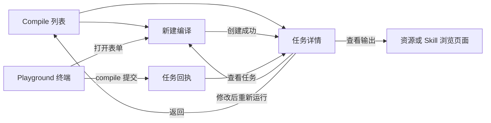

# Web Studio Compile 交互与实现设计

| 项目 | 内容 |
| --- | --- |
| 状态 | 待实现设计 |
| 更新日期 | 2026-09-16 |
| 适用范围 | Web Studio Compile 独立导航页、Playground 终端、通用任务联动 |
| 核心流程 | 选择 Skill → 选择素材 → 设置输出 → 提交 → 查看执行 → 打开产物 |

## 1. 目标与边界

Compile 使用一个指定 Skill，加工一个或多个 OpenViking 素材目录，并将结果写入目标目录。用户应能理解“用什么方法、处理什么内容、结果放在哪里”，无需先学习 API 或 Runtime 配置。

提供两个平等入口：

1. **Compile 独立 Tab**：在 Studio 左侧工作区导航中增加 Compile，紧邻 Skills。提供任务列表、新建页、详情页。
2. **Playground 终端**：支持 compile 和 task 命令，适合熟悉 CLI 的用户；提交后可进入同一详情页。

本文的 Tab 指独立导航模块，不是 Playground 内部新面板。资源页、Skills 页第一版不增加额外创建入口。

第一版包含完整的创建、查询、取消、参数回填、再次运行和结果查看闭环，并补齐服务端分页。暂不包含定时执行、批量取消、任务删除、任务重命名、产物差异比较、运行中修改参数及通用 Skill 参数表单生成。

## 2. 当前能力与设计依赖

以下现状以本地源码为依据，不代表部署环境已验证。

| 能力 | 当前实现 | 本方案处理 |
| --- | --- | --- |
| 创建 | `POST /api/v1/compile`，202，返回 TaskRecord | 复用 |
| 必填参数 | `from`、`to`、`skill` | 映射三个表单区块 |
| 可选参数 | `instruction`、`args` | 补充要求、折叠高级参数 |
| 查询详情 | `GET /api/v1/tasks/{task_id}` | 复用，携带 `include_events=true` |
| 查询列表 | `GET /api/v1/tasks`，默认 50、最多 200，无游标 | 增加兼容的分页模式 |
| 取消 | `POST /api/v1/tasks/{task_id}/cancel`，ROOT 禁止取消 | 复用并明确权限和状态 |
| 原始输入 | `meta.request` 保存公开请求字段 | 用于详情及回填；敏感参数不回显 |
| 执行事件 | 详情可返回 `execution_events` | 复用已有事件展示，缺失时不伪造 |
| 执行后端 | 外部 `compile_api` 或 `--with-bot` 本地执行服务 | 新增能力状态用于入口反馈 |
| Studio 终端 | 自有命令解释器，不是操作系统 Shell | 增加命令解析与 API 调用 |
| 原生 CLI | 已支持 `ov compile` 和 `ov task status/cancel/list` | Studio 对齐对应语法 |

`docs/design/ov-compile-design.md` 保留了历史 Bot 直连方案。本文以现行 OpenViking 托管任务的接口为准；浏览器不直接调用 Runtime 或旧 Bot compile 接口。

## 3. 页面和路由

| 页面 | 路由 | 主要动作 |
| --- | --- | --- |
| 编译列表 | `/compile` | 筛选、加载更多、新建、点击任务 |
| 新建编译 | `/compile/new` | 选择 Skill/素材/输出、提交、保存草稿 |
| 编译详情 | `/compile/tasks/$taskId` | 查看执行、取消、打开结果、再次运行 |
| 基于任务新建 | `/compile/new?fromTask=$taskId` | 获取公开配置后回填，不立即提交 |
| 终端 | 现有 Playground terminal 面板 | 命令补全、提交、查询、取消、跳转详情 |

列表筛选放入 URL，例如 `?status=running&q=wiki`。草稿、指令、args 不放入 URL。详情页面的任务 ID 只定位任务，权限仍由服务端验证。

导航规则：

- 点击左侧 Compile 默认进入列表；不自动跳到上次任务。
- 点击列表行进入完整详情页，不用抽屉承载主要流程。
- 返回列表恢复筛选、已加载页面及滚动位置；刷新详情可直接重新获取任务。
- 外部直接进入详情时，“返回列表”落到默认列表。
- 列表行支持键盘 Enter、链接新标签打开；行内复制按钮不触发行跳转。
- 通用 Tasks 页面保留 compile 记录，并提供进入 Compile 详情的链接。



## 4. 页面一：Compile 列表

### 4.1 布局

```text
Compile                                           [新建编译]
使用 Skill 将素材整理为新的内容

[搜索 Skill、路径或任务 ID…]  [全部状态 ▾]  [刷新]

任务 / Skill             素材              状态       创建时间
monthly_wiki → 团队知识库  周报 等 2 个目录    运行中     今天 14:20
guide_builder → 操作指南  产品文档            已完成     今天 13:10
monthly_wiki → 月报       周报                失败       昨天 18:00

                        [加载更多]
```

### 4.2 列表字段与操作

| 字段 | 展示规则 |
| --- | --- |
| 任务标题 | 从请求派生“Skill 名称 → 输出目录名”；无请求信息时显示任务 ID |
| Skill | 显示名称；完整 URI 可通过详情查看，不依赖 Skill 当前仍存在 |
| 素材 | 第一个目录名及“等 N 个目录”；详情展示完整集合 |
| 状态 | 图标与文字共同表达，不只使用颜色 |
| 创建时间 | 本地时区，相对日期；悬停显示完整时间和时区 |
| 任务 ID | 行次要信息，支持复制 |

排序固定为 `created_at DESC, task_id DESC`。同一素材或同一目标的多次执行分别保留，不应用通用 Tasks 页面按资源去重的逻辑。

行点击只负责打开详情。第一版不在行内堆叠取消、重跑和输出等按钮，这些操作集中在详情。

### 4.3 筛选与分页

- 状态选项：全部、排队中、运行中、取消中、已完成、失败、已取消。
- 搜索覆盖当前用户可见的全部历史任务，范围为任务 ID、公开请求中的 Skill URI、来源 URI、目标 URI；不搜索 instruction 和 args。
- 搜索输入防抖 300 ms；更改筛选时回到第一页，清除旧游标并取消过时请求。
- 每页 30 条，“加载更多”追加结果；失败在按钮位置重试，不清空已加载内容。
- 无下一页时显示“已显示全部可用记录”，不显示未经计算的任务总数。
- 初次查询失败显示错误和重试，不能显示为“暂无任务”。
- 新任务提示为“有新任务，点击刷新”；浏览历史时不自动插入并推动列表。
- 列表可见时每 10 秒刷新第一页；仅更新已显示 ID 的状态，新 ID 先显示提示。详情页拥有更及时的单任务刷新。
- 分页是实时记录浏览，不是严格快照。状态筛选期间任务可能移入或移出集合；刷新后重新建立游标链，不承诺固定总数。

### 4.4 空状态与服务状态

| 场景 | 文案与操作 |
| --- | --- |
| 无历史任务 | “使用 Skill，把已有素材整理成新的内容。”＋“新建编译” |
| 筛选无结果 | “没有符合条件的任务。”＋“清除筛选” |
| 加载失败 | “任务列表加载失败。”＋“重试” |
| 执行服务未配置 | 顶部说明“当前连接尚未启用编译服务”；历史记录仍可查看，创建入口禁用并提供原因 |
| 能力状态获取失败 | 显示“暂时无法确认编译服务状态”及重试；不误报为未配置，可进入表单并由提交接口最终判定 |

## 5. 页面二：新建编译

### 5.1 表单布局

采用单页分组表单，不使用多步弹窗。Skill 在最前面，帮助用户先理解加工方式，再选择输入和输出。

```text
[返回列表]  新建编译                           草稿已保存

1  使用哪个 Skill？ *
   [搜索并选择 Skill                              ▾]
   按月汇总周报，生成主题知识页         [查看 Skill]

2  处理哪些素材？ *
   [选择目录]  [粘贴 URI]
   周报        viking://resources/weekly          [移除]
   项目记录    viking://resources/projects        [移除]

3  将结果保存到哪里？ *
   [viking://resources/team-wiki             ] [浏览]
   目标目录尚不存在，执行时按后端能力创建

补充要求
[例如：按主题整理，保留引用来源，优先使用最近一个月的材料]

▸ 高级参数（可选）

使用 monthly_wiki，处理 2 个目录，输出到 team-wiki
[复制命令]                               [取消] [开始编译]
```

底部操作区在长表单中保持可见，但不遮挡字段错误或屏幕键盘。窄屏取消横向摘要，将完整路径换行显示。

### 5.2 Skill 选择

点击后打开可搜索选择面板。每项显示名称、简短描述、所属范围和 URI；同名 Skill 依靠范围、URI 区分。

- 只列当前身份可见的 Skill，不通过 URI 文本推断权限。
- 搜索结果缺少描述时显示 URI，不生成未经验证的用途说明。
- 首次打开不自动选中任意 Skill；只有草稿或复制任务时预选。
- “查看 Skill”打开侧边预览，显示实际 `SKILL.md`，保留主表单上下文。
- 预览读取失败不丢失选择，提供重试；提交时仍由后端验证其有效性。
- 无 Skill 时显示“还没有可用的 Skill”，提供“前往 Skills”；离开前保存公开草稿。
- 切换 Skill 保留素材、输出和指令。args 非空时提示“已更换 Skill，请检查高级参数”；不静默删除参数。
- 不假设 Skill 描述能可靠推导输出类型或参数 schema，第一版不自动生成专属表单。

### 5.3 素材目录选择

“选择目录”打开带面包屑的目录选择器，支持进入目录、多选目录及跨目录保留选择。

- 文件可见时置灰并解释“请选择所在目录”；禁止直接选文件作为 from。
- 已选项以完整 URI 去重，保留选择顺序；后端最终 canonicalize。
- 手动粘贴支持每行一个 URI，逐条校验并展示错误；无效项可编辑，不清空其它内容。
- 选择父目录后再选择其子目录时提示可能存在重叠，不静默删除用户选择。
- 目录不存在、不可读、连接失败使用不同文案；检查中显示局部 loading。
- 不递归扫描所有内容来估算 token、价格或执行时间。

### 5.4 输出位置

复用目录浏览交互，支持直接输入新路径。字段下持续显示完整 URI，避免同名目录混淆。

- 支持后端允许的 resource、memory 和 skills 目标；具体合法位置以后端校验为准。
- 技能产物目标必须符合支持的 skills 命名空间，不能按普通目录规则任意嵌套。
- 来源和目标重叠时提示“结果将写入素材范围，后续执行可能读取这些结果”，不强制替用户更改路径。
- 已有目标提示“此目录已有内容，执行可能更新其中内容”。不展示尚未支持的“只新增”“自动覆盖”等策略选项。
- 新目录提示仅表示路径未存在，不在填写表单时提前创建远端目录。
- 目标为文件、无写权限或命名空间根不合法时就地报错。
- 可做轻量存在性检查；写权限和业务合法性必须由创建接口最终确认，不将 stat 成功当作可写证明。

### 5.5 补充要求与高级参数

instruction 可留空，空字符串归一化为未设置。输入框示例不作为默认提交值。

args 使用折叠的 JSON 编辑区，默认空；支持格式化、错误定位，只接受 JSON 对象。解析失败时禁用提交并将错误定位到编辑器。

第一版高级参数仅保留于当前页面内存，不写入本地草稿或终端持久历史。复制命令默认省略 args，并明确提示；用户显式选择“包含高级参数”后才纳入剪贴板。服务端公开请求可能脱敏，不能将脱敏占位值作为真实参数再次提交。

### 5.6 草稿、离开与恢复

- 一个身份范围保存一份公开草稿：Skill、from、to、instruction；键包含连接、账号、用户，禁止跨身份复用。
- 字段变更后防抖保存，显示“草稿已保存”；存储失败显示“草稿未保存”，不阻断编辑。
- 再次进入新建页提示“已恢复上次草稿”，提供“清空”。
- 返回列表或点击取消保留公开草稿；“取消”不创建任务。
- 有未保存输入或内存中的 args 时，离开弹出“继续编辑 / 离开并丢弃未保存内容”。正常已保存草稿不反复确认。
- 成功提交后清除本次草稿；提交失败保留全部输入。
- `fromTask` 回填前若已有草稿，提供“继续现有草稿 / 使用任务配置”；不得静默覆盖。
- 页面刷新无法恢复 args，在高级参数附近明确提示其不自动保存。

### 5.7 提交交互

1. 点击“开始编译”，检查必填项、URI 基本格式和 args；聚焦首个错误字段。
2. 校验通过后生成本次提交标识，按钮改为“正在提交”，禁止重复提交；保留可见摘要。
3. 创建成功后跳转任务详情，提示“任务已创建，离开页面不会中断执行”。
4. 请求参数、权限或配置错误就地展示；有可定位字段时关联字段，否则显示表单顶部错误。
5. 请求超时或断连时提示“尚未确认是否创建成功”，不宣称创建失败，不直接发起全新任务。
6. 在服务端幂等能力支持下，“重试确认”复用同一提交标识；参数改变则必须先解决原请求状态或明确新建另一任务。

正常提交不增加确认弹窗。取消正在提交的页面导航只停止前端等待，不承诺撤销服务端创建。

## 6. 页面三：任务详情

### 6.1 布局

```text
[返回列表]  monthly_wiki → 团队知识库       [修改后重新运行]
cmp_... [复制]    运行中    已运行 2 分 18 秒       [取消任务]
当前阶段：后端报告的阶段名称     最后更新：14:22:18
可以离开页面，任务会继续执行

[概览]  [执行记录]  [结果]

概览
Skill       monthly_wiki                    [查看 Skill]
素材        周报、项目记录                   [展开路径]
输出        viking://resources/team-wiki     [打开目录]
补充要求    按主题整理，保留来源
创建时间 / 更新时间 / 完成时间（有可靠数据时）
▸ 高级参数（仅公开、脱敏后的内容）
```

顶部生命周期状态由 `status` 决定，`stage` 只补充当前阶段，不用字符串猜测覆盖 status。未知状态显示“未知状态”及原始值，不自动当作完成。

### 6.2 概览

- 全量展示本次请求的公开配置；超长来源列表默认显示前三项，可展开全部。
- Skill 链接读取的是当前版本，标注“查看当前 Skill”；后端无快照信息时不声称这是运行时版本。
- “打开目录”可以查看运行中的已有内容，但标注“执行中，内容可能继续变化”。目标不存在时显示“输出尚未生成”，不当作任务失败。
- 没有可靠完成时间时不将任意 `updated_at` 标为完成时间；结束耗时仅在后端提供可确认时间时展示。
- 旧任务缺少 `meta.request` 时显示“该任务未记录完整创建参数”，不从 resource_id 拼凑可执行请求。

### 6.3 执行记录

- 按后端事件顺序展示时间、事件名称、说明及可展开详情；复用现有事件组件。
- 没有事件时显示“暂未提供执行记录”，仍显示任务状态和 stage。
- 不展示模拟日志、虚构的阶段完成勾选或百分比。
- 用户停留底部时自动跟随；向上滚动后暂停跟随，显示“有新记录 / 回到底部”。
- 原始结构化信息默认折叠，敏感字段应在服务端脱敏，前端不负责恢复。
- 若事件历史被截断，展示后端提供的截断提示；没有事件分页能力时不承诺完整日志。

### 6.4 结果

| 状态 | 结果区 |
| --- | --- |
| 未结束 | “任务完成后将在此展示结果”；可查看已有目标目录 |
| 已完成且有标准产物 | 结果摘要、产物链接、主要按钮“打开输出目录” |
| 已完成但 result 为空或格式未知 | “任务已完成”，提供输出目录；未知结构放入“原始结果” |
| 失败 | 错误原因、可展开技术信息、“修改后重新运行”；可能存在部分产物时允许查看目标 |
| 已取消 | “任务已停止；已写入的内容可能保留”，可查看目标和基于参数新建 |

产物链接必须来自明确 URI，不能仅凭 result 中任意字符串生成跳转。resource、memory、skills 使用对应浏览能力；暂不能直接定位的 URI 提供复制及可用的目录浏览入口。

第一版不假设存在统一的 created/updated 文件列表，不显示未经后端确认的文件数量、覆盖差异或“全部成功写入”结论。

### 6.5 取消与再次运行

取消按钮仅在后端可取消状态及身份下启用。ROOT 显示禁用原因“当前 ROOT 身份不能取消任务”，不能仅隐藏后使用户误认为不支持。

点击取消打开轻量确认框：“停止此任务？已经写入的内容可能保留。”按钮为“继续执行 / 停止任务”。请求成功后依据返回状态显示取消中或实际终态，不立即伪造 cancelled。

- 请求失败保留真实状态并允许重试。
- 取消期间任务已经完成时，展示最终完成状态并说明结果已更新。
- “修改后重新运行”只打开预填表单，不隐式创建任务；原任务不受影响。
- 缺少敏感参数或公开参数被脱敏时提示需要重新填写，不提交脱敏占位符。
- 当前 Skill 已删除或权限变化时回填 URI 并标为待重新选择；不阻止用户查看旧任务。

### 6.6 刷新、恢复与通知

- 活跃任务详情可见时每 5 秒查询；浏览器隐藏时暂停，重新聚焦立即刷新。
- 终态停止自动轮询，保留手动刷新；未知状态使用低频刷新并允许重试。
- 后端 provider 可能以更长间隔刷新状态，前端查询频率不等于执行进度更新频率。
- 连续请求失败采用有上限的退避；显示“暂时无法更新，以下为最近状态”，不将任务改为 failed。
- 返回列表、刷新浏览器、关闭终端都不取消任务；恢复后重新查询服务端。
- 当前页面观察到完成时显示一次带“查看结果”的通知，不主动切换用户正在查看的子页。
- 不承诺浏览器关闭后的系统通知；第一版不请求浏览器通知权限。
- 404 统一显示“任务不存在、已过期或当前身份不可访问”，提供返回列表；不泄露其他用户任务。

## 7. Playground 终端交互

### 7.1 命令集

```bash
compile --from viking://resources/weekly --to viking://resources/wiki --skill viking://agent/skills/monthly_wiki --instruction "按主题整理，保留来源"
task status cmp_example
task list --task-type compile --status running
task cancel cmp_example
```

同时接受可选的 `ov` 前缀。from 支持重复参数和逗号分隔，与原生 CLI 对齐。compile 成功后立即返回回执，不阻塞用户输入下一条命令。

这是 Studio 命令语法，不能执行 Shell 的管道、重定向、命令替换或环境变量展开。明确拒绝不支持的语法，不传给系统 Shell。

### 7.2 提示与补全

- 输入 `compile` 显示用途、必填参数、一个可运行结构的示例及“打开可视化表单”。单独回车显示帮助，不创建空任务。
- 参数补全区分 `--from` 的可读目录、`--skill` 的 Skill 和 `--to` 的目标路径。
- 缺参时展示准确字段，如“缺少 --skill”，并允许将已解析值带入表单。
- 无效 JSON 指出 `--args` 必须是对象，不输出完整可能含凭证的输入。
- 支持单引号、双引号、转义及 JSON 字符串；共享专门的解析模块，不继续使用空格 split。
- 终端到表单通过身份隔离的内存交接保存参数，地址栏不携带参数；不能恢复的高级参数明确提示。

### 7.3 提交回执与后续操作

```text
任务已创建
任务：cmp_example
状态：排队中
输出：viking://resources/wiki
[查看任务]  [复制任务 ID]
```

回执卡片可在可见时刷新状态，复用同一任务查询缓存；不为历史每张卡片分别长期轮询。点击“查看任务”进入 Compile 详情。

task status 展示状态、阶段、错误或结果摘要及详情链接。task list 展示分页结果及“加载更多”，明确范围是当前连接与身份。task cancel 属于用户明确取消指令，不再弹二次确认，返回“正在取消”或真实终态，并说明已有写入可能保留。

历史只持久化经过处理的命令摘要及任务 ID，args 不落盘；含高级参数的原始命令不得进入现有命令历史、entry title 或错误文本。重用历史时提示补齐参数。

表单“复制命令”采用统一转义生成器，并与解析器做往返验证。正常公开字段可复制，默认省略 args；复制内容必须与当前表单实际值一致。

## 8. 接口补充设计

本节均为拟新增契约，不能当作当前接口已支持。

### 8.1 创建及公开请求

现有请求保持兼容：

```json
{
  "from": ["viking://resources/weekly"],
  "to": "viking://resources/wiki",
  "skill": "viking://agent/skills/monthly_wiki",
  "instruction": "按主题整理，保留来源"
}
```

前端通过适配层读取 `meta.request`，不要让页面散落依赖任意 meta 字段。无参数快照时禁用自动回填并解释原因。

### 8.2 创建幂等

为 `POST /api/v1/compile` 增加可选 `Idempotency-Key`。幂等范围为连接对应服务内的 account、user、操作类型及 key。

- 同 key、同规范化请求返回同一 task_id；同 key、不同请求返回明确冲突。
- 请求校验失败不产生任务；校验通过后的幂等登记与任务创建必须具备原子保证。
- 并发请求和服务重启不能产生重复任务，需持久化幂等关联。
- 建议幂等映射至少保留 24 小时，并在契约中说明保留期；超出保留期不自动重发。
- 浏览器仅保存 key 与确认状态，不持久化 args。页面恢复后可通过下述 lookup 找回已创建任务。
- 拟增加 `GET /api/v1/compile/submissions/{key}`：在相同身份下返回已关联任务或明确的未找到；不得返回私有请求。
- lookup 未找到但原请求可能仍在途时，同 key 重试仍由原子幂等处理，不能改用新 key。

现有 provider 的内部幂等 key 以已生成的 OV task_id 为基础，不能替代浏览器重复创建请求的幂等保护。

### 8.3 任务分页与搜索

为通用列表增加显式分页模式，避免破坏当前数组返回值：

```http
GET /api/v1/tasks?pagination=cursor&task_type=compile&limit=30&status=running&q=wiki
GET /api/v1/tasks?pagination=cursor&task_type=compile&limit=30&status=running&q=wiki&cursor=opaque-token
```

```json
{
  "status": "ok",
  "result": {
    "items": [],
    "next_cursor": null,
    "has_more": false
  }
}
```

- 未传 `pagination=cursor` 时保持现有数组返回，现有 CLI 和 Tasks 调用不受影响。
- 服务端使用 `created_at DESC, task_id DESC` 的键集分页，过滤先于分页；读取 `limit + 1` 判断 has_more。
- cursor 是服务端生成的不可随意篡改标识，绑定排序版本、过滤条件和身份范围。过期或条件不匹配返回明确错误，前端提示重新加载。
- `q` 只对明确的公开字段搜索，不读取私有 args；新 Compile 页固定 `task_type=compile`。
- 从持久化存储层实现分页，不能延续“全部读入内存再截取”的做法来声称完成服务端分页。
- ROOT 的可见范围、系统任务及普通身份隔离沿用现有权限规则；分页、搜索不得扩大可见范围。
- 列表按 task_id 去重；状态变化导致筛选集合变化时，以刷新重新建立列表为准。
- total 暂不返回，避免额外计数和不稳定总数产生误导。

### 8.4 能力查询

拟增加 `GET /api/v1/compile/capabilities`，用于当前身份的入口提示，至少返回：

```json
{
  "status": "ok",
  "result": {
    "configured": true,
    "can_create": true,
    "reason_code": null
  }
}
```

configured 仅表示已配置执行后端，不承诺 Runtime 此刻健康。can_create 表示静态配置与身份允许尝试创建，不替代 URI 权限检查。不得返回 gateway token、API Key 或内部地址。网络故障作为查询失败处理，不能返回 configured=false。

取消能力依旧按角色、任务状态和后端响应判断。若后续统一任务接口提供 allowed_actions，前端再迁移使用，第一版不依赖尚不存在字段。

## 9. 状态、数据隔离与组件复用

所有 Query key、草稿和内存交接包含当前连接及 identityScopeKey；切换身份时中止旧请求、清空可见旧数据。每个任务 ID 在同一身份下共享缓存，避免终端、详情和列表互相显示过期状态。

建议模块边界：

| 模块 | 职责 |
| --- | --- |
| Compile API 适配层 | 创建、能力、幂等恢复、分页、详情、取消 |
| Compile 列表页 | 筛选、分页、列表状态及导航 |
| Compile 新建页 | 草稿、字段编排、提交状态 |
| Compile 详情页 | 状态、配置、执行记录、结果、操作 |
| Skill 选择器 | 搜索、选择和当前内容预览 |
| Viking 目录选择器 | 浏览、单选/多选、粘贴 URI、局部错误 |
| Compile 表单模型 | 参数归一化、校验、公开回填、命令生成 |
| 终端命令模块 | tokenize、compile/task 解析、回执、历史脱敏 |

复用 Studio 的按钮、表单、目录浏览、任务状态和事件组件，不复制一套任务生命周期实现。业务文件保持职责单一，单文件不超过 800 行。

## 10. 视觉、可访问性与文案

- 沿用现有 Studio 主题、排版、间距和 Lucide 图标，不为 Compile 引入另一套设计语言。
- 每页只有一个突出主动作：列表“新建编译”、表单“开始编译”、完成详情“打开输出目录”。
- loading、空数据、错误和无权限必须是可区分状态。
- 字段有真实 label、必填标识和关联错误；目录选择器支持键盘操作，弹层关闭后焦点返回触发按钮。
- 状态变化采用适度的 aria-live 提示，不每次轮询朗读整页。
- URI 可复制、可换行；截断只用于列表，详情始终可查看完整值。
- 所有文案通过中英文 i18n 管理；错误原文保留在技术详情中。
- 移动端表格退化为紧凑列表，表单保持单列；主要按钮满足可触达尺寸。

## 11. 关键流程验收

| 场景 | 验收标准 |
| --- | --- |
| 首次创建 | 空列表 → 新建 → 选 Skill、两个素材目录、输出 → 提交 → 详情，可打开结果 |
| 查看历史 | 进入列表、筛选、加载更多、点击详情、返回，筛选和位置不丢失 |
| 超过 200 条 | 能通过服务端游标访问更早记录，不局限于内存中的 200 条 |
| Skill 不可用 | 清楚显示缺失或权限问题，保留其它表单值，可替换 Skill |
| 参数错误 | 定位具体字段；非法 JSON 不发送请求；含空格指令完整保留 |
| 双击与网络超时 | 双击只产生一个任务；超时使用相同 key 恢复到同一个 task_id |
| 刷新页面 | 详情恢复服务端状态；公开草稿恢复；args 不泄露或静默回填占位值 |
| 取消竞争 | 运行中取消、取消请求失败、同时完成等情况均显示服务端最终状态 |
| 再次运行 | 回填公开参数，可修改；原任务保留，新提交产生新 task_id |
| 执行失败 | 显示可读错误和技术详情，可调整参数再次提交，可查看已有目标 |
| 状态断连 | 保留最后状态并提示更新时间，不将网络错误映射为任务失败 |
| 终端互通 | 带引号、重复 from、JSON args 正确解析，提交回执可打开同一详情 |
| 身份切换 | 列表、详情缓存和草稿不串号；旧请求不能覆盖新身份页面 |
| 结果不完整 | result 为空、未知结构、无事件时页面仍可操作，不显示虚构统计 |
| 历史与敏感参数 | 终端命令历史、草稿、URL、错误提示不保存原始 args |
| 可访问性 | 键盘完成创建与查看，错误可聚焦，状态不只依赖颜色 |

验证分三层：参数解析和状态模型的单元验证；真实 API 契约与分页/幂等/权限验证；浏览器端到端验证。构建或类型检查通过不能替代真实创建、取消和结果浏览的验证。

## 12. 实施顺序与完成条件

1. **后端契约**：完成分页与公开字段搜索、创建幂等及恢复、能力查询；保持旧任务列表返回兼容，更新 OpenAPI。
2. **基础模块**：同步 Studio SDK，完成 API 适配层、目录/Skill 选择器、表单模型和身份隔离。
3. **独立页面**：交付列表、新建、详情三页及公开草稿、状态刷新、结果入口。
4. **终端接入**：完成语法解析、补全、回执、task 操作、命令复制及持久历史处理。
5. **联动与验收**：通用 Tasks 添加 compile 类型和详情链接，跑通上述关键流程。

完成标准是两个入口使用相同任务模型，用户能够创建、追踪、取消、恢复、再次运行并找到结果，历史浏览具备真实分页。接口增强未完成时可开发页面，但不能把模拟数据或本地分页作为完整交付。

## 13. 源码依据

- `openviking/server/routers/compile.py`：创建路由。
- `openviking/service/compile_service.py`：请求模型、URI 校验、执行后端配置、结果快照。
- `openviking/service/external_task_service.py`：公开请求保存、外部执行任务生命周期。
- `openviking/server/routers/tasks.py`：任务详情、列表和取消。
- `openviking/service/task_tracker.py`：TaskRecord 与现有列表读取逻辑。
- `web-studio/src/components/app-shell.tsx`：导航结构。
- `web-studio/src/routes/tasks/route.tsx`：现有通用任务页。
- `web-studio/src/routes/tasks/-components/task-detail-sheet.tsx`：任务查询、事件展示与刷新基础。
- `web-studio/src/routes/playground/-components/terminal-panel.tsx`：现有终端解析、历史和回执。
- `crates/ov_cli/src/commands/compile.rs`、`crates/ov_cli/src/main.rs`：原生 CLI 参数和 task 命令。

## 14. 本分支实现说明（2026-09-16）

`feat/studio-compile` 实现独立列表、新建与详情页面，以及 Playground 终端的 `compile` / `task` 命令。支持 Skill 查询与内容预览、目录浏览与多来源输入、公开草稿、参数回填、取消、结果目录跳转、中英文文案和终端到表单的内存参数交接。

服务端增加可选游标分页、公开字段搜索、Compile 能力查询、`Idempotency-Key` 创建去重及提交结果查询；未启用游标模式的任务列表保持数组返回。

实现边界：

- AGFS 当前没有任务索引查询，分页逐条扫描持久化记录，通过有界堆保留当前页，不把所有任务载入 TaskTracker。记录对象内存受页大小约束，目录枚举和读取成本仍随历史记录数量增长；不是索引级查询。
- 游标包含身份、角色和筛选范围，并使用当前服务进程的密钥签名。服务重启后旧游标失效，刷新列表可恢复。多实例部署需要共享游标签名配置。
- 幂等标识派生为稳定任务 ID，参数摘要保存在任务记录中但不通过公共 API 回显；同标识的并发创建与恢复在当前实例内串行。已创建请求先按身份及规范化请求摘要恢复，不重新依赖素材、Skill 或执行后端仍然可用；新请求仍执行完整资源与权限校验。保障建立在现有单 TaskTracker 写入者模型上，多写入者部署仍需存储级 CAS。
- 幂等恢复与任务记录共用保留周期。当前 tracker 对完成/取消任务保留 24 小时，对失败任务保留 7 天；此功能不新增永久历史。页面对超过 24 小时的持久提交标识停止自动重发。分页扫描会清理当前身份目录中的过期记录，清理前在任务锁内复查状态；不将全量历史载入缓存。
- 公开高级参数可从历史任务回填，但不保存到浏览器草稿。复制命令默认不包含高级参数；没有“一键复制私有参数”的入口。
- 结果页面提供输出目录入口及后端原始结果；不假设不同 Runtime 已统一产物清单、进度百分比和完成时间字段。
- 本地验证包含后端 HTTP/持久化测试、前端单元测试及浏览器可控 API 场景。真实执行服务与模型产物需要部署环境联调验证。
